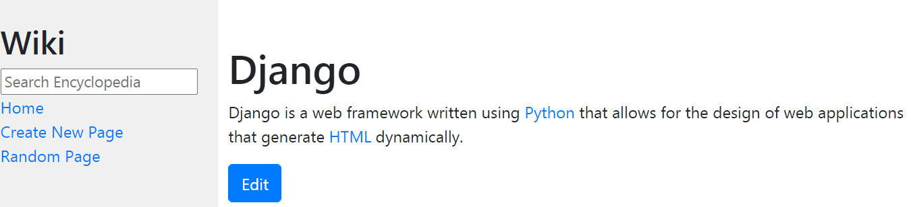
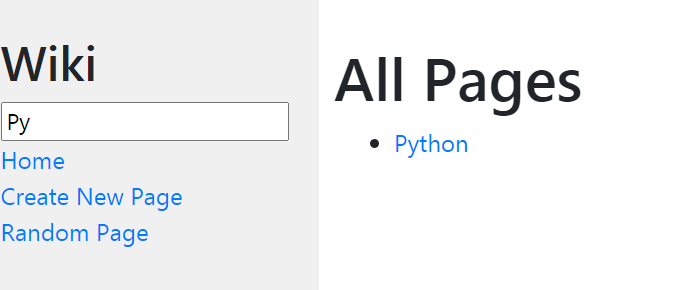
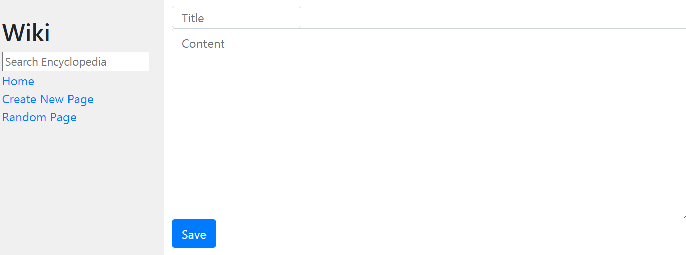

# Encyclopedia
I designed a Wikipedia-like online encyclopedia.
Instead of using HTML to store encyclopedia, i used a lighter-weight human-friendly markup language.For this project, i’ll store encyclopedia entries using a markup language called **Markdown**.

Here you can see all entry names listed on the home page, user can click on any entry name to be taken directly to that entry page.
On the left you can notice the search box where the user is allowed to query to search for an encyclopedia entry, if the query **exactly** matches the name of any encyclopedia, the user will get redirected to that encyclopedia page, where you can also edit it content by clicking on the edit button

if the query doesn't **exactly** match the name of an encyclopedia entry, the user should instead be taken to a search results page that displays a list of all encyclopedia that have the query as part of its title, for example, if you searched for **py**, **Python** entry will appear in your page
 , you can click on the entry to go that entry page.
You can create a new encyclopedia by clicking on the *Create New Page* button on left, you need to implement a title that no have used before, and you need to enter the Markdown content and save it after. 
There's also a *Random Page* button that will take you to a random encyclopedia page.
