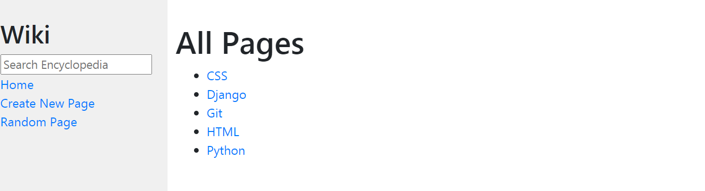

# Wiki

> Home page

---

## Description

 Wiki is a Wikipedia-like online encyclopedia. Instead of using HTML to store encyclopedia, i used a lighter-weight human-friendly markup language. For this project, i’ll store encyclopedia entries using a markup language called **Markdown**.

#### What i have used

- HTML
- Css
- Python
- Django
- Bootstrap

[Back To The Top](#wiki)

---

## How To Use

- ### Home

  In the *Home* page user can see all entry titles.

  - When user clicks on:

    - `Entry title`: he will be taken directly to that entry page.

    - `Home`: wherever the user is, he will get redirected to the *Home* page.

    - `Create new page`: he will go to page where he need to implement a *title* that it's not used, and enter the Markdown content, and click `Save` after.

    - `Random page`: he will get redirected to a random encyclopedia page.

- ### Searching
    The search is very simple and user friendly, if the query **exactly** matches the name of any encyclopedia, the user will get redirected to that encyclopedia page, if not, the user should instead be taken to a search results page that displays a list of all encyclopedia that have the query as part of its title.
    
    -  For example: \
      If the query was **py**, **Python** entry will appear.

      > See [Search](https://github.com/amen6/Wiki/blob/main/Images/Python.png)

- ### Edit
  User can edit a page content by going to that encyclopedia page, and clicking the `Edit` button.

[Back To The Top](#wiki)

---
